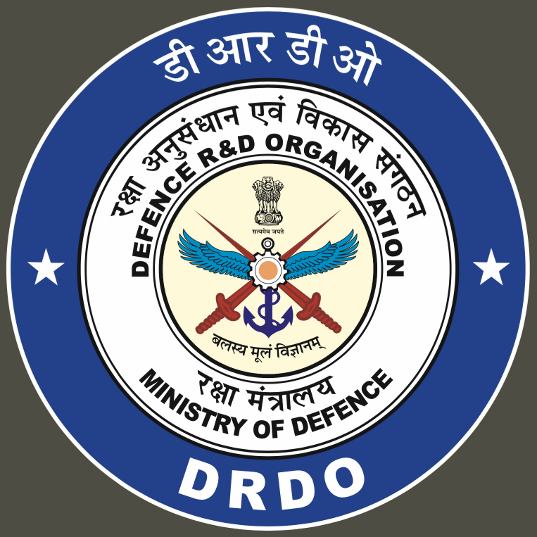

<table border="0" style="width: 100%;">
  <tr>
    <td align="right" style="width: 150px; vertical-align: middle;">
      
    </td>
    <td>
      <h1 style="color: #00008B;">AMC Monitoring Portal&nbsp;&nbsp;&nbsp;&nbsp;&nbsp;&nbsp;&nbsp;&nbsp;&nbsp;&nbsp;&nbsp;&nbsp;&nbsp;&nbsp;&nbsp;&nbsp;&nbsp;&nbsp;&nbsp;&nbsp;&nbsp;</h1>
    </td>
  </tr>
</table>

**Organization:** ADRDE (DRDO), Agra  
**Internship Duration:** 4 Weeks (June 2025) 
**Description:** Team project completed at the organization during the internship. 

## Project Overview
The AMC (Annual Maintenance Contract) Monitoring Portal is a task management system designed to efficiently oversee, schedule, and report daily, weekly, and monthly tracking under AMC agreements. The portal provides role-based access, real-time dashboards, alerts, and compliance tracking to streamline IT infrastructure maintenance.

## Key Features
- **Dashboard Overview**
- **Task Categories**
- **Task Assignment & Scheduling**
- **Task Completion Tracking**
- **Reminders and Alerts**
- **Maintenance History**
